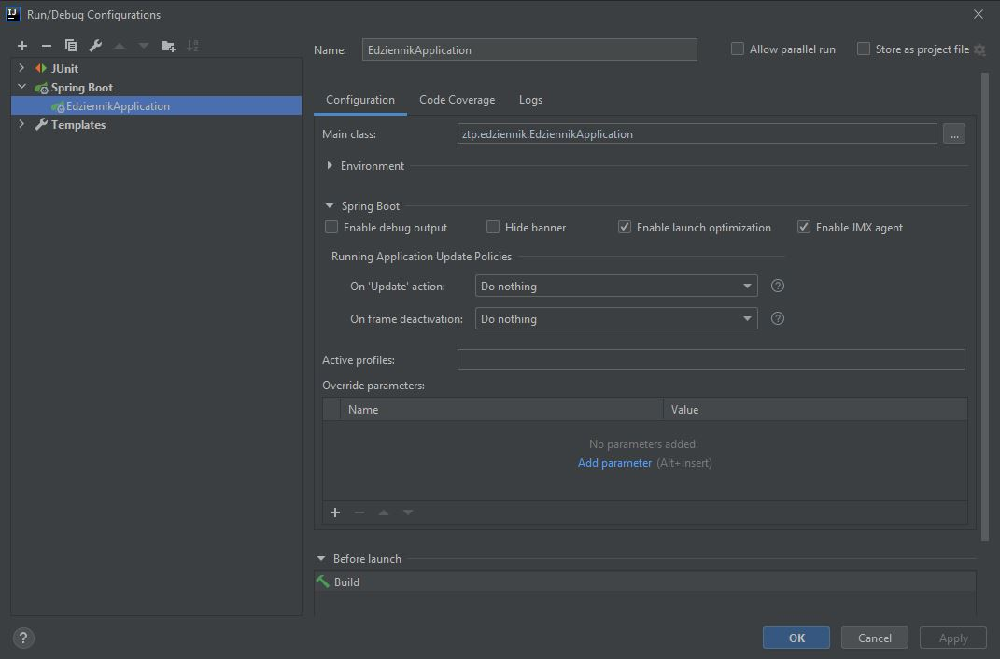
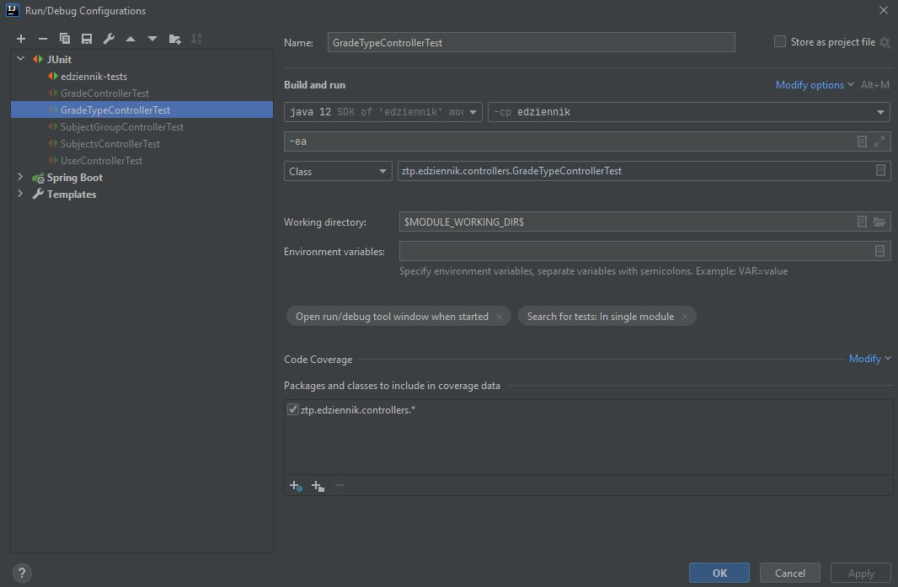

edziennik backend how to run instruction
========================================

- In order to run application
  - create Spring Boot run configuration
  - set main class to: ztp.edziennik.EdziennikApplication
    

- In order to run tests
    - create JUnit configuration
    - set in Build and Run section, class which you want to run for example: ztp.edziennik.controllers.GradeTypeControllerTest
    
